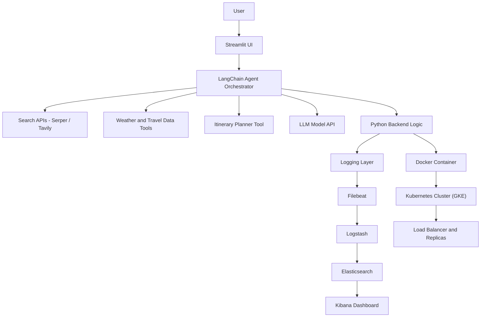

## 🌍 LLMOPS AI Travel Agent

An end-to-end **Agentic AI Travel Planning System** built with modern LLMOps, cloud-native deployment, and observability best practices. This project demonstrates how to design autonomous AI agents, deploy them at scale using containers and Kubernetes, and monitor them using the ELK stack.

---

## 🚀 Project Overview

The **LLMOPS AI Travel Agent** is an intelligent assistant that generates personalized travel itineraries. Users can input their **destination, budget, interests, and travel dates**, and the system autonomously breaks the task into multiple sub-tasks such as:

* Finding hotels
* Checking weather conditions
* Suggesting attractions and museums
* Planning daily itineraries

The project focuses on **Agentic AI + MLOps + Cloud Engineering + Observability**.

---

## 🧠 Key Modules & Workflow

### 1️⃣ Agentic AI Development

#### 🔹 LangChain Agents

* Designed autonomous workflows where the LLM decomposes a travel query (e.g., *"3 days in Paris"*) into structured sub-tasks:

  * Find hotels
  * Check weather
  * Suggest museums and attractions
  * Generate daily itinerary plans

#### 🔹 Real-Time Tooling (Search APIs)

* Integrated external search APIs (Serper / Tavily) to fetch real-time information.
* Prevents hallucinations by grounding responses with live data (e.g., closed attractions, updated prices).

#### 🔹 Interactive UI (Streamlit)

* Built a user-friendly frontend using **Streamlit**.
* Users can input:

  * Budget
  * Interests (culture, food, adventure, shopping)
  * Travel dates
  * Destination

---

### 2️⃣ Containerisation & Orchestration

#### 🐳 Dockerization

* Packaged the entire application and dependencies into a Docker container.
* Ensures consistent execution across local, cloud, and production environments.

#### ☸️ Kubernetes (GKE Deployment)

* Deployed the containerized application on **Google Kubernetes Engine (GKE)**.
* Managed:

  * Pod replicas
  * Load balancing via services
  * Scalability for multiple users

---

### 3️⃣ LLMOps & Observability

#### 📊 ELK Stack Integration

* Implemented centralized logging using:

  * **Elasticsearch** – log storage and indexing
  * **Logstash** – log ingestion pipeline
  * **Kibana** – visualization and monitoring dashboard

* Captured:

  * Application logs
  * API requests
  * Token usage metrics

#### 📈 Scalable Deployment

* Applied LLMOps principles to ensure:

  * Fault tolerance
  * Monitoring and debugging
  * High availability for AI services

---

## 🏗️ Tech Stack

| Category             | Tools & Technologies                  |
| -------------------- | ------------------------------------- |
| LLM Framework        | LangChain                             |
| Frontend             | Streamlit                             |
| Containerization     | Docker                                |
| Orchestration        | Kubernetes (GKE)                      |
| Logging & Monitoring | Elasticsearch, Logstash, Kibana (ELK) |
| Programming Language | Python                                |
| Cloud Platform       | Google Cloud Platform (GCP)           |

---

## 🏛️ Project Architecture Diagram



### 🔹 Architecture Flow Explanation

1. **User interacts with Streamlit UI** to submit travel preferences.
2. **LangChain Agent Orchestrator** decomposes the request into sub-tasks.
3. Agents call **real-time tools (Serper/Tavily)** and the **LLM API**.
4. The backend processes results and generates a travel itinerary.
5. Logs are collected via **Filebeat → Logstash → Elasticsearch**.
6. **Kibana dashboards** visualize logs and metrics.
7. The entire system runs inside **Docker containers** deployed on **Kubernetes (GKE)** for scalability.

---

## 📂 Project Structure

```
LLMOPS-AI-Travel-Agent/
│
├── src/                    # Core application code
├── experiments/            # Research & experiments
├── logs/                   # Logging outputs
├── .vscode/                # VSCode configs
├── Dockerfile              # Docker container configuration
├── requirements.txt        # Python dependencies
├── app.py                  # Streamlit main app
├── setup.py                # Package setup
│
├── elasticsearch.yaml       # ELK Elasticsearch config
├── logstash.yaml             # Logstash pipeline config
├── kibana.yaml               # Kibana config
├── filebeat.yaml             # Filebeat config
├── k8s-deployment.yaml       # Kubernetes deployment file
└── README.md                 # Project documentation
```

---

## 🧪 Features & Learning Outcomes

### 🤖 Agentic Workflows

* Built autonomous AI agents that can **think, plan, and execute tools**.

### ☁️ Cloud-Native Engineering

* Hands-on Kubernetes deployment on GCP.
* Learned container orchestration and scalability.

### 🌐 Real-Time AI Systems

* Connected LLMs with live search APIs to avoid outdated or incorrect responses.

### 🔍 Full-Stack Observability

* Implemented production-grade logging and monitoring using ELK.

### 🏭 Production-Ready AI Deployment

* Learned best practices for deploying scalable AI applications using Docker + Kubernetes.

---

## ⚙️ How to Run Locally

### 1️⃣ Clone the Repository

```bash
git clone https://github.com/Shilpi1612/LLMOPS-AI-Travel-Agent.git
cd LLMOPS-AI-Travel-Agent
```

### 2️⃣ Install Dependencies

```bash
pip install -r requirements.txt
```

### 3️⃣ Run the App

```bash
streamlit run app.py
```

---

## 🐳 Run with Docker

```bash
docker build -t travel-agent .
docker run -p 8501:8501 travel-agent
```

---

## ☸️ Deploy on Kubernetes (GKE)

```bash
kubectl apply -f k8s-deployment.yaml
```

---

## 📊 ELK Stack Setup

1. Start Elasticsearch
2. Configure Logstash pipelines
3. Run Kibana dashboard
4. Monitor logs and metrics in real-time

---

## 📌 Future Improvements

* Add multi-language support
* Integrate booking APIs (hotels & flights)
* Add vector database for long-term memory
* Deploy using CI/CD pipelines (GitHub Actions)
* Implement user authentication

---

## 👩‍💻 Author

**Shilpi Chadokar**
Data Science & AI Enthusiast | LLMOps Learner

---

## ⭐ If you like this project, give it a star!**

